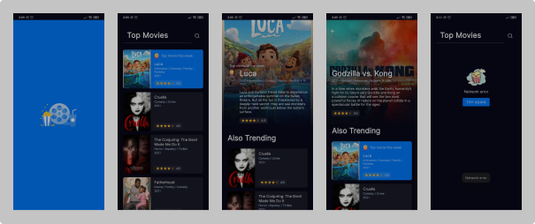
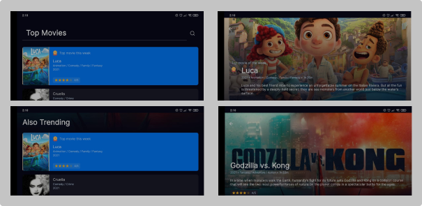
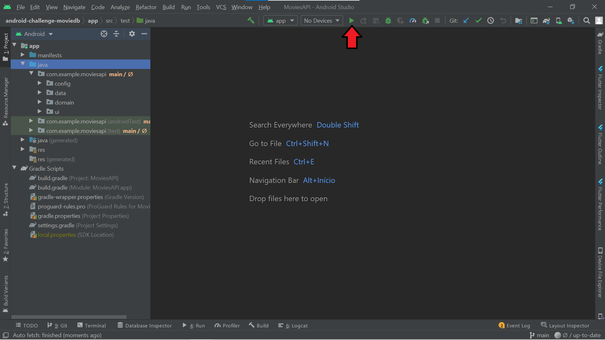
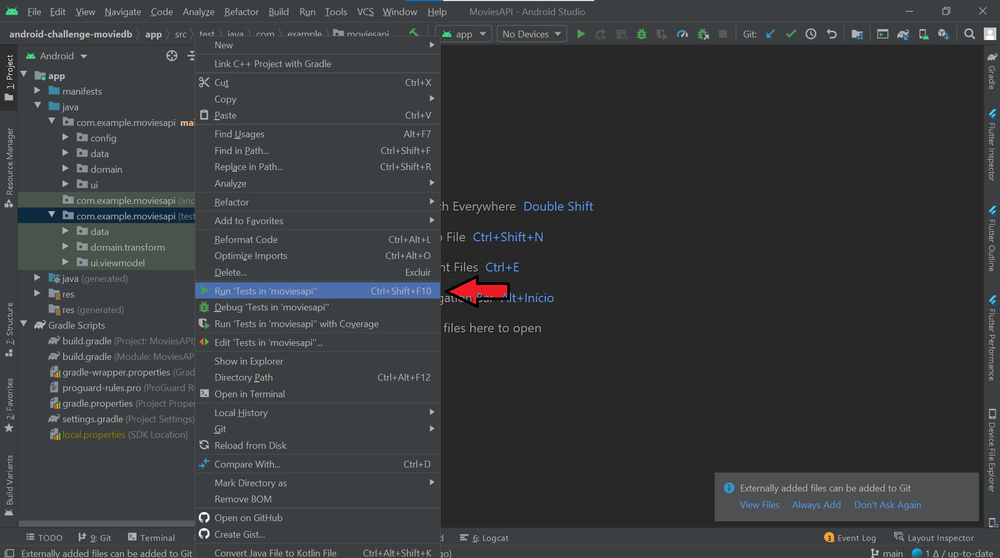

# Movie API
### Portrait

### Landscape

## About this project

An Android App to list movies

## User functionalities

- Display movies from [TMDB API](https://developers.themoviedb.org/3/getting-started/introduction)

## Getting Started

### Prerequisites

To run this project in the development mode, you'll need to have a basic environment to run an Android App, that can be found [here](https://developer.android.com/studio).
After that you can run the app in an Android Emulator, [here is a guide for configure it](https://developer.android.com/studio/run/emulator#install), or with a physical device with developer mode on, [here is a guide for it](https://developer.android.com/studio/debug/dev-options).

### Running

Click in this button. 

### Running Tests

No device requiered.

## Built With
- [Android SDK](https://developer.android.com/) - Create an Android App
- [Kotlin](https://developer.android.com/kotlin) - Develop Android apps with Kotlin
- [Retrofit](https://square.github.io/retrofit/) - A type-safe HTTP client for Android and Java
- [Koin](https://insert-koin.io/) - Dependency injection
- [MockK](https://mockk.io/) - Mock library for tests
